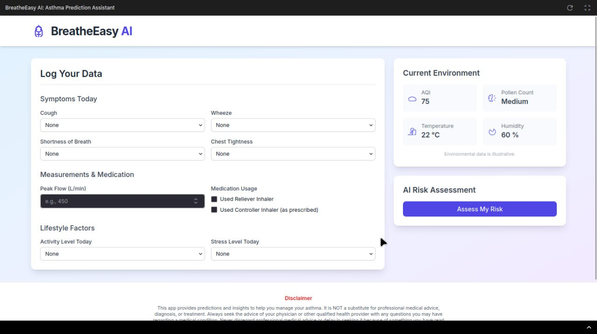

# BreatheEasy AI: Asthma Prediction Assistant


> If you find this project helpful, please consider ⭐ [starring the repository](https://github.com/dragonpilee/breatheeasy-ai)!

---

BreatheEasy AI is a web-based application designed to help users log asthma-related symptoms, lifestyle factors, and medication usage. It integrates with (mocked) environmental data and utilizes the Google Gemini API to provide a personalized asthma exacerbation risk assessment and actionable advice.

---



---

## ✨ Core Features

- **Symptom & Data Logging**: Easily log daily symptoms (cough, wheeze, shortness of breath, chest tightness), peak flow measurements, medication usage (reliever/controller), activity levels, and stress levels.
- **Environmental Data Display**: Shows current (mocked) environmental conditions like AQI, pollen count, temperature, and humidity.
- **AI-Powered Risk Assessment**: Leverages the Google Gemini API (`gemini-2.5-flash-preview-04-17` model) to analyze user input and environmental data, predicting a risk level (Low, Medium, High) for asthma exacerbations.
- **Personalized Advice**: Provides brief, actionable advice based on the AI's assessment.
- **Responsive Design**: User interface built with Tailwind CSS for usability across different devices.

---

## 🛠️ Technology Stack

- **Frontend**: React, TypeScript, Tailwind CSS
- **AI Integration**: Google Gemini API (`@google/genai` SDK)
- **Module Loading**: ES Modules via import maps (using `esm.sh` for CDN)

---

## 🚀 Setup and Running the Application

This application is designed to run directly in a browser that supports modern JavaScript (ES Modules).

### Prerequisites

- A modern web browser (e.g., Chrome, Firefox, Edge, Safari).
- An internet connection (for fetching CDN dependencies and API calls).

### API Key Configuration (Crucial)

This application requires a Google Gemini API Key to function correctly for the AI risk assessment feature.

1. **Obtain an API Key**: Get your API key from [Google AI Studio](https://aistudio.google.com/app/apikey).
2. **Environment Variable**: The application's `geminiService.ts` file expects the API key to be available as `process.env.API_KEY`.

   For the application to access this key when run client-side (e.g., by opening `index.html` directly or via a simple static server), you would typically need a build step (like Vite, Webpack, Parcel) to replace `process.env.API_KEY` with an actual key at build time, or serve the application via a backend that can inject this key.

   **IMPORTANT SECURITY NOTE**:  
   **Never hardcode your API key directly into the client-side JavaScript files that are committed to a public repository.** The `process.env.API_KEY` mechanism is standard for server-side or build-time injection to keep keys secure. If you are running this purely client-side for development without a build process, you would need to temporarily modify `geminiService.ts` to include your key, but **DO NOT COMMIT THIS CHANGE.**

   The current project structure assumes `process.env.API_KEY` is somehow made available in the execution context where the JavaScript runs.

### Running

1. **Ensure `process.env.API_KEY` is accessible**: This is the most critical step for the AI features. How this is achieved depends on your local development setup or deployment environment.
2. **Open `index.html`**:
    - You can serve the project directory using a simple HTTP server. For example, using Python:
        ```bash
        python -m http.server
        ```
        Then navigate to `http://localhost:8000` (or the port shown) in your browser.
    - Alternatively, for very basic testing (though some browser security features might interfere with module loading or API calls), you might be able to open `index.html` directly from your file system in a browser. A local server is generally recommended.

---

## ⚠️ Disclaimer

This app provides predictions and insights to help you manage your asthma. It is **NOT a substitute for professional medical advice, diagnosis, or treatment.**

Always seek the advice of your physician or other qualified health provider with any questions you may have regarding a medical condition. Never disregard professional medical advice or delay in seeking it because of something you have read or seen on this app.

The AI-generated risk assessment is based on the provided data and patterns learned by the model; it is for informational purposes only and may not be accurate in all cases.

---

## 👤 Developed By

Alan Cyril Sunny

---
